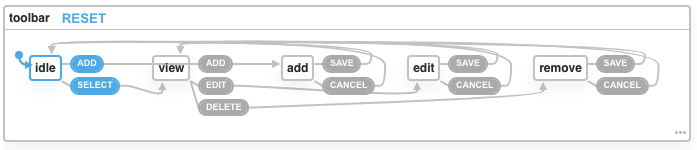
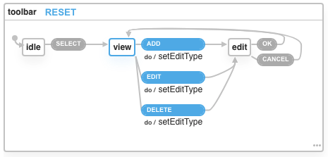
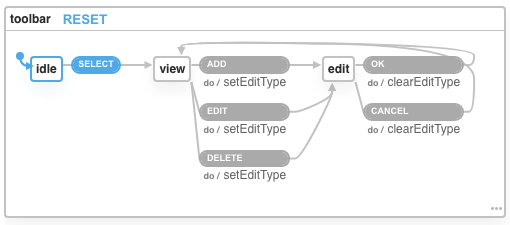

I have been reading about XState by @davidkpiano and wanted to try how it could simplify the frontend code. Recently I got involved in a proof of concept rewrite of a small accounting application and while going through a CRUD form, found this code to enable/disable toolbar buttons.

```jsx
// visual basic code
Private Sub OnOffCMDs(isOn As Boolean)
    CmdAdd.Enabled = isOn
    CmdEdit.Enabled = isOn
    CmdDelete.Enabled = isOn
    CmdSave.Enabled = !isOn
    CmdCancel.Enabled = !isOn
End Sub
```

This function is used to enable/disable all buttons. This code implies two states and either Add/Edit/Delete are enabled or Save/Cancel. As we are using react for the rewrite, I found this as a perfect opportunity to try XState.

So I started reading some of the blogs again and watched the excellent youtube video by @davidkpiano and it all looked quite simple. But when I started to design the state machine using the xstate visualizer, it was not quite simple in the beginning. I had to sit down and draw the state machine on paper a couple of times to understand how it should work.

First of all, we need to add the required modules.

```
yarn add xstate, @xstate/react
```

The user interface consists of a tree component and a form. The user needs to select an account from the tree before he/she can perform any action in the form. So following the XState samples, we need to add an initial state.

Here's the first version of toolbarMachine.

```jsx
import { Machine } from "xstate";

export const toolbarMachine = Machine({
  id: "toolbar",
  initial: "idle",
  states: {
    idle: {
      on: {
        ADD: "add",
        SELECT: "view",
      },
    },
    view: {
      on: {
        ADD: "add",
        EDIT: "edit",
        DELETE: "remove",
      },
    },
    add: {
      on: {
        SAVE: "idle",
        CANCEL: "idle",
      },
    },
    edit: {
      on: {
        SAVE: "view",
        CANCEL: "view",
      },
    },
    remove: {
      on: {
        SAVE: "idle",
        CANCEL: "view",
      },
    },
  },
});
```

Trying this machine in the visualizer looks like below.


As you can see, there is a total of five states, and for each state, we have defined the actions (corresponding to toolbar buttons) and transitions to the next state. This is simple and it works. We can use the useMachine hook to use this machine in a functional component.

```jsx
import { toolbarMachine } from '../components/CoaState'
import { useMachine } from "@xstate/react";

const comp = () => {
  const [state, send] = useMachine(toolbarMachine);
  ...
  return (<div>
      <Button onClick={() => send('ADD')}    disabled={state.value !== 'view'}>Add</Button>
      <Button onClick={() => send('EDIT')}   disabled={state.value !== 'view'}>Modify</Button>
      <Button onClick={() => send('DELETE')} disabled={state.value !== 'view'}>Delete</Button>
      <Button onClick={() => send('OK')}     disabled={!isEditing(state.value)}>OK</Button>
      <Button onClick={() => send('CANCEL')} disabled={!isEditing(state.value)}>Cancel</Button>
    </div>)
};

const isEditing = (value) => {
  return value === 'add' || value === 'edit' || value === 'remove'
}

```

The state is used to access the current state and the send method can be used to transition to another state. The helper function isEditing just checks if the current state is one of add, edit, or remove. This looked ok but I wanted to see if it is possible to have a single (parent) state for add/edit/remove to avoid <code>isEditing</code> helper function. Although XState has a concept of hierarchical states but that just adds a set of states inside a state.

##Context to the rescue##
XState provides an option to extend the state with the context. It can hold any piece of information and can be used as below.

```jsx
import { Machine } from "xstate";

export const toolbarMachine1 = Machine(
  {
    id: "toolbar",
    initial: "idle",
    context: {
      editType: "",
    },
    states: {
      idle: {
        on: {
          SELECT: "view",
        },
      },
      view: {
        on: {
          ADD: {
            target: "edit",
            actions: "setEditType",
          },
          EDIT: {
            target: "edit",
            actions: "setEditType",
          },
          DELETE: {
            target: "edit",
            actions: "setEditType",
          },
        },
      },
      edit: {
        on: {
          OK: "view",
          CANCEL: "view",
        },
      },
    },
  },
  {
    actions: {
      setEditType: (ctx, evt) => (ctx.editType = evt.type),
    },
  }
);
```

This is how it will look in the visualizer. 

So now we are down to three states with edit state using context to store the type of edit (i.e., add, edit or delete). There is a setEditType action to set the context to event type which happens to be all the context information we needed for now.
You can also notice the use of expanded syntax for actions like ADD/EDIT/DELETE. This is required to use actions. Also note that, if we need to invoke multiple actions, we can use an array instead of a string.
This is looking better except the code duplication. While playing with this machine in the visualizer, I also found that the context is not being cleared on OK and CANCEL actions. So let's do some refactoring to tackle both of these issues.

```jsx
import { Machine } from "xstate";

const editing = {
  target: "edit",
  actions: "setEditType",
};
const viewing = {
  target: "view",
  actions: "clearEditType",
};
export const toolbarMachine = Machine(
  {
    id: "toolbar",
    initial: "idle",
    context: {
      editType: "",
    },
    states: {
      idle: {
        on: {
          SELECT: "view",
        },
      },
      view: {
        on: {
          ADD: { ...editing },
          EDIT: { ...editing },
          DELETE: { ...editing },
        },
      },
      edit: {
        on: {
          OK: { ...viewing },
          CANCEL: { ...viewing },
        },
      },
    },
  },
  {
    actions: {
      setEditType: (ctx, evt) => (ctx.editType = evt.type),
      clearEditType: (ctx) => (ctx.editType = ""),
    },
  }
);
```

This will result in a subtle change in the visualizer. 

This is looking much better now. We have removed code duplication and have also added a clearEditType action to clear the editType from the context. This will also result in getting rid of the isEditing helper function and just using the context to enable/disable Ok and Cancel buttons.

```jsx
<Button onClick={() => send('OK')}     disabled={state.context.editType !== ''}>OK</Button>
<Button onClick={() => send('CANCEL')} disabled={state.context.editType !== ''}>Cancel</Button>
```

Please note that the useMachine hook creates a new machine on each invocation so it should only be used inside your main component and then the state can be passed to the child component via props.

##Benefits##

- All states are well defined and known. Transitions paths are defined so it's not possible to end up in an invalid state.
- States are well defined and encapsulated inside machine definition. The state machine also captures the state transitions.
- Testing the state machine is easy. Please see model-based testing in the Resources section.
- Using a state management library not only results in reduced bugs but also promotes better developer experience and ease of maintenance.
- You can use the XState visualizer to visualize as well as test the state transitions. The visualizer has a <code>state</code> tab to check the current state and a <code>event</code> tab to send events. It lists the possible events based on the current state and lists all the past events for easier playback.

##Where to go from here##

I've covered a very simple example in this post as a starting point. XState has a lot more features that I will cover in a future post.

##Resources##

- [Official XState Docs](https://xstate.js.org/docs)
- [XState visualizer](https://xstate.js.org/viz)
- [State Driven interfaces with XState by Brad Woods](https://blog.logrocket.com/state-driven-interfaces-with-xstate/).
- [Example UI Components wiht XState](https://bradwoods.io/guides/xstate).
- [Excellent guidelines by Kyle Shevlin](https://kyleshevlin.com/guidelines-for-state-machines-and-xstate#hierarchical-machines).
- [Model-based testing in React with State Machines](https://css-tricks.com/model-based-testing-in-react-with-state-machines/)
- One of my all-time favorites talk is [Making impossible states impossible](https://www.youtube.com/watch?v=IcgmSRJHu_8) by [Richard Feldman](https://twitter.com/rtfeldman).

<hr/>
