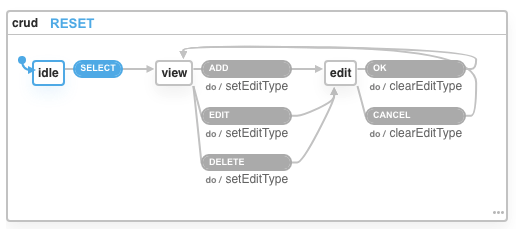

I have been reading many blogs about xstate by @davidkpiano but wanted to try it out for a while. Recently I got involved in a proof of concept rewrite of a small application and while going through a CRUD form, found this code to enable/disable toolbar buttons.
yes

```jsx
// visual basic code
Private Sub OnOffCMDs(isOn As Boolean)
    CmdReturn.SetFocus
    CmdAdd.Enabled = isOn
    CmdModify.Enabled = isOn
    CmdDelete.Enabled = isOn
    CmdSave.Enabled = isOn
    CmdCancel.Enabled = isOn
End Sub
```

So this function is used to enable/disable all buttons and then individual buttons are set based on the current state of the form (albeit without state management).
As we are using react for the rewrite, I found this as a perfect opportunity to try xstate.

So I started reading some of the blogs again and watched the excellent talk by @davidkpiano and it all looked quite simple. But when I started to design the state machine using the xstate visualizer, it was not quite simple in the beginning. I had to actually sit down and draw the state machine on paper a couple of times to understand how it should actually work.

```jsx
export const toolbarMachine = Machine({
  id: "toolbar",
  initial: "idle",
  states: {
    idle: {
      on: {
        ADD: "add",
        SELECT: "view",
      },
    },
    view: {
      on: {
        ADD: "add",
        EDIT: "edit",
        DELETE: "remove",
      },
    },
    add: {
      on: {
        SAVE: "idle",
        CANCEL: "idle",
      },
    },
    edit: {
      on: {
        SAVE: "view",
        CANCEL: "view",
      },
    },
    remove: {
      on: {
        SAVE: "idle",
        CANCEL: "view",
      },
    },
  },
});
```

Trying this machine in the visualizer looks like below.


##Resources##

- [Official XState Docs](https://xstate.js.org/docs)
- [XState visualizer](https://xstate.js.org/viz)
- [State Driven interfaces with XState by Brad Woods](https://blog.logrocket.com/state-driven-interfaces-with-xstate/).
- [Excellent guidelines by Kyle Shevlin](https://kyleshevlin.com/guidelines-for-state-machines-and-xstate#hierarchical-machines).
